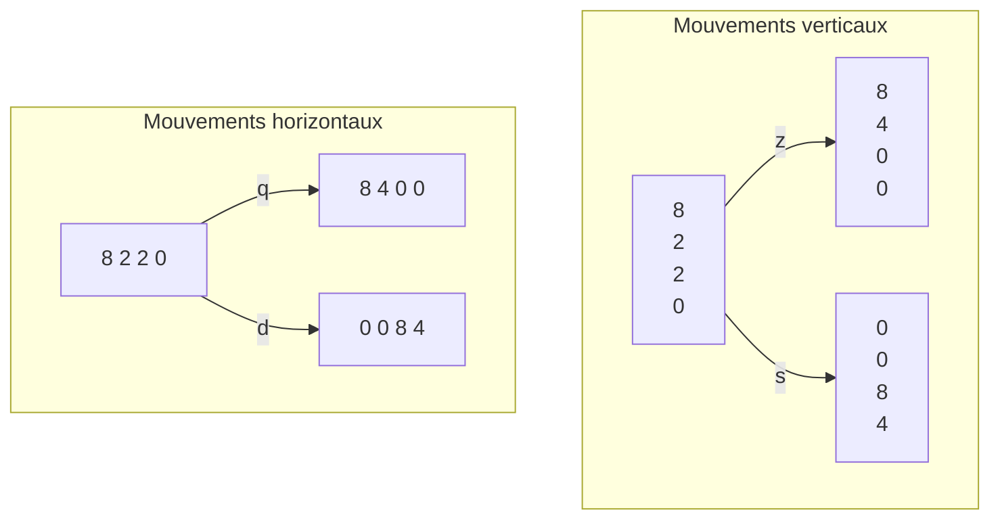

# Package Jeu 2048

Petit package python pour jouer au jeu 2048.

Documentation détaillée: https://matdplot.github.io/jeu-2048/

## Setup
- Télechargez le package sur la page gitlab: https://github.com/MatDplot/jeu-2048/
- Installez le package de façon pérenne avec la commande suivante: `python3 -m pip install -e .` ou `python3 setup.py install` depuis le dossier du package (assurez vous d'avoir les droits ou inclure le package dans le path)
- Jouez au jeu en utilisant `python3 -m jeu2048` ou tout simplement `jeu2048`

## Règles

- Choisisez une taille du plateau (celui-ci est carré)
- Utilisez z pour déplacer les cases vers le haut, s pour le bas, q pour la gauche et d pour la droite
- Lorsque 2 cases portant le même nombre entrent en contact elles s'additionnent
- Une fois un mouvement effectué, un 2 ou un 4 apparaît (80% et 20% de chance respectivement)

### Exemple des mouvements permis

## Fin de partie

- Pour gagner vous devez arriver à atteindre le nombre 2048
- Vous perdez si vous ne pouvez plus faire aucun mouvement
